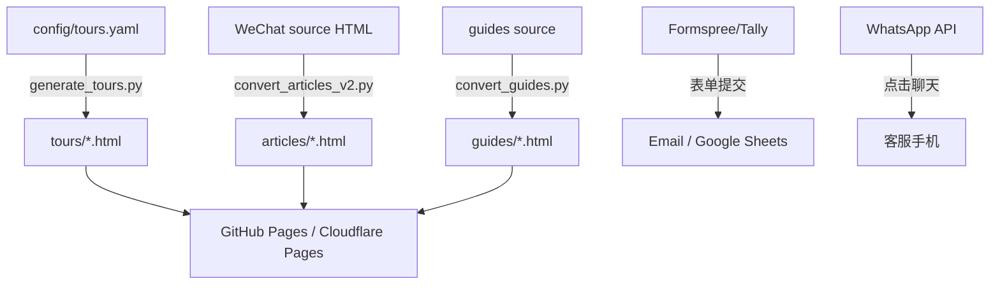

# TibetRide.com 转型过渡方案 PRD v1.0

> 从 Motorcycle Tibet 内容博客 → TibetRide 直营团旅游产品销售站

---

## 1. 现状诊断

### 1.1 当前项目定位
- **品牌**: Motorcycle Tibet（西藏摩旅）
- **内容**: 摩托车旅行游记、路线指南、装备建议、摄影作品
- **受众**: 摩托车骑士、硬核自驾玩家
- **技术**: 纯静态 HTML/CSS/JS + Python 构建管道（微信文章 → 静态页面）
- **转化**: 无（仅 about.html 有 Facebook/YouTube/WhatsApp 二维码）

### 1.2 转型后定位
- **品牌**: TibetRide.com
- **业务**: 西藏直营团旅游产品（自己组织/带队）
- **受众**: 计划前往西藏的普通游客（非摩旅专业群体）
- **核心页面**: 产品线路页 + SEO 攻略文章 + 咨询转化系统
- **技术**: 静态站点 + 轻量数据层 + 第三方表单服务

---

## 2. 分阶段过渡方案

### 阶段 0: 基础设施准备（1-2 周）
**目标**: 建立产品数据层和构建管道，不改变现有页面

| 任务 | 说明 |
|------|------|
| 创建 `config/tours.yaml` | 定义 Tour 产品数据模型（见第 3 节） |
| 创建 `scripts/generate_tours.py` | 从 YAML 生成 tours/ 目录下的产品详情页 |
| 创建 `scripts/generate_tour_index.py` | 生成 tours/index.html 产品列表页 |
| 新增 `templates/tour_page.html` | Tour 产品页模板（复用现有 CSS 变量和组件） |
| 更新 `scripts/build.py` | 增加 `tours` 构建阶段，整合进统一 pipeline |

**产出**: 访问 `/tours/` 可看到产品列表，但首页和导航暂不改动

### 阶段 1: 首页转型（1 周）
**目标**: 首页从"摩旅博客"转变为"旅游产品销售着陆页"

**首页结构调整**:
```
[导航栏] 更新为: Home | Tibet Tours | Travel Guide | About | Contact
[Hero]   新文案: "Explore Tibet With Local Experts"
         CTA: "View Tours" / "Get Free Quote"
[Why Us] 新增: Local Experts / Tibet Permit / Small Group / 24/7 Support
[Featured Tours] 新增: 从 config/tours.yaml 读取前 4 个产品
[Trust]  新增: 客户评价模块（首期可用静态文案）
[SEO Articles] 保留现有精选文章入口，但弱化展示
[CTA Banner] 新增: "Customize My Trip" 表单入口
[Footer] 更新品牌为 TibetRide
```

**技术实现**:
- 重写 `index.html`，复用 `css/main.css` 的 CSS 变量和组件类
- Hero 区域保留现有图片或更换为更具旅游感的西藏全景
- 产品卡片复用现有的 `.card` 和 `.route-card` 样式

### 阶段 2: 产品页体系（1-2 周）
**目标**: 建立完整的产品展示和转化页面

**页面清单**:
| 页面 | URL | 说明 |
|------|-----|------|
| 产品列表 | `/tours/index.html` | 所有线路卡片，支持按天数/主题筛选 |
| 产品详情 | `/tours/<slug>.html` | 每个 Tour 的独立详情页 |
| 定制咨询 | `/customize.html` | 自由定制表单页 |

**产品详情页结构**:
```
[Hero] 线路名称 + 天数 + 起价 + CTA
[Overview] 行程亮点图标列表
[Itinerary] 每日行程展开/折叠
[Inclusions] 费用包含/不含
[Pricing] 价格表（不同人数对应不同单价）
[FAQ] 常见问题
[CTA] "Get Free Quote" 表单按钮 + WhatsApp 浮动按钮
```

### 阶段 3: SEO 文章矩阵（持续进行）
**目标**: 新增 30 篇 SEO 文章，构建自然流量入口

**内容分类**:
- 基础问题（10篇）: "How to get Tibet Permit", "Best time to visit Tibet"...
- 景点介绍/目的地页（10篇）: "Potala Palace Guide", "Everest Base Camp Tour"...
- 线路推荐（5篇）: "7 Days Lhasa Shigatse", "9 Days Everest Base Camp"...
- 高流量问题（5篇）: "Tibet travel cost", "Is Tibet safe for tourists"...

**技术方案**:
- 文章存放于 `/guides/` 目录（不与现有 `/articles/` 冲突）
- 每篇文章底部增加 "Related Tours" 模块，链接到 `/tours/` 产品页
- 复用现有 `convert_articles_v2.py` 构建流程，新增 `guides/` 输出目录

### 阶段 4: 转化系统（1 周）
**目标**: 建立从浏览到咨询的完整转化链路

**表单方案**（推荐静态站点 + 第三方服务）:
| 方案 | 工具 | 成本 | 说明 |
|------|------|------|------|
| 推荐 | Formspree / Tally | 免费-$20/月 | 无需后端，表单提交后邮件通知 |
| 备选 | GetForm / Basin | 免费-$10/月 | 类似功能，可存到 Google Sheets |
| 进阶 | Netlify Forms | 免费-付费 | 如果部署在 Netlify |

**转化触点**:
- 首页 Hero CTA → 跳转到 tours 列表或 customize 表单
- 产品卡片 "Get Free Quote" → 预填充 Tour 名称的表单
- 浮动 WhatsApp 按钮 → 右下角固定，点击打开 WhatsApp 聊天
- 文章页底部 CTA → "Plan Your Tibet Trip" 引导到表单

### 阶段 5: 内容资产迁移与 SEO（1 周）
**目标**: 保护现有 SEO 权重，逐步迁移有价值的内容

**现有内容处理**:
- `/articles/` 下的文章: **保留**，更新页脚品牌为 TibetRide
- `/routes.html`: 重写为 "Travel Routes" 页面，弱化摩托车元素，增加 Tours 入口
- `/about.html`: 重写为 TibetRide 品牌介绍 + 团队介绍
- `/articles/index.html`: 保留作为 "Travel Stories" 子页面，导航中改名为 Travel Guide

**SEO 保护措施**:
- 所有现有 URL 保持 301 不变（静态 HTML 站无 301 能力，需确保 URL 不被删除）
- 现有文章的 meta title/description 逐步更新为 TibetRide 品牌
- 新增 `/tours/` 页面添加 canonical URL 和结构化数据（JSON-LD）

### 阶段 6: 品牌与视觉统一（1 周）
**目标**: 全面替换 Motorcycle Tibet 品牌元素

**替换清单**:
- Logo: `&#x1F3CD;` → 新 TibetRide Logo（或文字 Logo）
- 品牌名: "Motorcycle Tibet" / "西藏摩旅" → "TibetRide"
- Footer 版权: "Tibet Moto Travel" → "TibetRide.com"
- 所有页面 `<title>` 和 meta description
- 配色: 可保留现有 `#b91c1c`（藏红）为主色，增加 `#0f766e`（松石绿）作为辅助色

---

## 3. 产品数据模型

### 3.1 `config/tours.yaml` 结构

```yaml
tours:
  - slug: lhasa-5-days
    name: "5 Days Lhasa Essence Tour"
    nameZh: "拉萨精华5日游"
    duration: 5
    durationUnit: "days"
    startingPrice: 598
    currency: "USD"
    maxGroupSize: 8
    difficulty: "Easy"
    bestSeason: "Apr - Oct"
    coverImage: "images/tours/lhasa-5days.jpg"
    highlights:
      - "Potala Palace guided tour"
      - "Jokhang Temple & Barkhor Street"
      - "Norbulingka Summer Palace"
      - "Tibetan welcome dinner"
    itinerary:
      - day: 1
        title: "Arrival in Lhasa"
        desc: "Airport pickup, hotel check-in, acclimatization rest."
        meals: ["Dinner"]
        accommodation: "Lhasa 4-star hotel"
      - day: 2
        title: "Potala Palace & Jokhang Temple"
        desc: "..."
        meals: ["Breakfast", "Lunch"]
        accommodation: "Lhasa 4-star hotel"
      # ... more days
    inclusions:
      - "Tibet Travel Permit (TTP)"
      - "Licensed English-speaking guide"
      - "4-star hotel accommodation"
      - "All meals as listed"
      - "Airport transfers"
    exclusions:
      - "International flights to/from Lhasa"
      - "Personal expenses"
      - "Travel insurance"
    pricing:
      - travelers: 2
        pricePerPerson: 598
      - travelers: 4
        pricePerPerson: 498
      - travelers: 6
        pricePerPerson: 428
      - travelers: 8
        pricePerPerson: 398
    faq:
      - q: "Do I need a Tibet Travel Permit?"
        a: "Yes. We handle all permit applications for you."
    metaTitle: "5 Days Lhasa Tour | TibetRide - Explore Tibet With Local Experts"
    metaDescription: "Discover the heart of Tibet in 5 days. Visit Potala Palace, Jokhang Temple, and Barkhor Street with our expert local guides. Small groups, all permits included."
```

### 3.2 构建流程

```
config/tours.yaml
    ↓
scripts/generate_tours.py  (读取 YAML → 生成 tours/*.html)
    ↓
tours/lhasa-5-days.html    (使用 templates/tour_page.html)
tours/everest-9-days.html
...
    ↓
scripts/build.py --all     (整合到统一构建管道)
```

---

## 4. 技术架构决策

### 4.1 推荐方案: 静态站点 + 第三方服务



**优势**:
- 零后端维护成本
- 免费托管（GitHub Pages / Cloudflare Pages）
- 构建管道已成熟，只需扩展
- 快速上线，风险低

**局限**:
- 无用户登录/订单管理
- 表单数据需手动从邮件/Google Sheets 导出
- 无法做动态价格/库存管理

### 4.2 进阶方案（MVP 验证后）

如果月咨询量 > 50 或需要在线支付，可考虑：
- **引入轻量 CMS**: TinaCMS / Decap CMS 管理产品数据
- **引入后端**: Supabase 或 Firebase 存储订单/咨询数据
- **支付集成**: Stripe / PayPal 定金支付

---

## 5. 信息架构（新）

```
/
├── index.html                    [首页 - 销售着陆页]
├── tours/
│   ├── index.html                [产品列表]
│   ├── lhasa-5-days.html         [产品详情]
│   ├── lhasa-shigatse-7-days.html
│   ├── everest-9-days.html
│   ├── kailash-12-days.html
│   └── ...
├── guides/
│   ├── index.html                [SEO 文章列表]
│   ├── tibet-travel-permit.html
│   ├── best-time-visit-tibet.html
│   └── ... (30篇)
├── articles/
│   ├── index.html                [现有文章列表 - 改名为 Stories]
│   └── *.html                    [保留现有摩旅文章]
├── about.html                    [关于 TibetRide]
├── customize.html                [定制咨询表单]
├── contact.html                  [联系方式]
├── css/
│   ├── main.css                  [复用现有 + 新增组件]
│   └── lang.css                  [保留双语切换]
├── js/
│   ├── main.js
│   └── lang.js                   [保留双语切换]
├── images/
│   └── tours/                    [产品封面图]
├── config/
│   └── tours.yaml                [产品数据源]
└── scripts/
    ├── build.py                  [统一构建入口]
    ├── generate_tours.py         [新增]
    ├── generate_tour_index.py    [新增]
    └── ...                       [现有脚本保留]
```

**导航栏**:
```
Home | Tibet Tours | Travel Guide | About | Contact
         ↓              ↓
      tours/        guides/ + articles/
```

---

## 6. SEO 与转化策略

### 6.1 关键词布局

| 页面类型 | 目标关键词 | 搜索意图 |
|---------|-----------|---------|
| 首页 | "tibet tour", "tibet travel" | 品牌/导航 |
| 产品页 | "5 days lhasa tour", "everest base camp tour" | 交易 |
| 目的地页 | "lhasa travel guide", "everest base camp guide" | 信息+交易 |
| 攻略文章 | "how to get tibet permit", "best time visit tibet" | 信息 |

### 6.2 内部链接结构

```
首页 → 产品列表 → 产品详情 → 咨询表单
  ↓         ↓           ↓
攻略文章 ← 目的地页 ← 产品详情
  ↓
相关 Tours 推荐
```

### 6.3 转化漏斗

```
自然搜索流量 (目标: 3000/月)
    ↓
SEO 文章 / 产品页着陆
    ↓
浏览内容 (停留时间 > 2min)
    ↓
点击 "Get Free Quote" / WhatsApp
    ↓
填写咨询表单 (目标转化率: 4-6%)
    ↓
客服跟进 → 成交
```

---

## 7. 风险评估与应对

| 风险 | 影响 | 应对 |
|------|------|------|
| 现有摩旅受众流失 | 中 | 保留 `/articles/` 作为 Stories 子栏目，逐步淡化而非删除 |
| 产品价格无竞争力 | 高 | 先以 "Small Group / Local Expert" 差异化定位，不直接比价 |
| SEO 排名下降 | 中 | 保留所有现有 URL，逐步更新内容而非删除 |
| 表单服务不稳定 | 低 | 准备备选方案（Formspree / Tally 双接入） |
| 产品图片不足 | 中 | 先用 Unsplash/自有照片，后续补拍专业产品图 |

---

## 8. 实施优先级

**第一周（阶段 0）**:
- [ ] 创建 `config/tours.yaml` 并录入首批 4 个产品
- [ ] 创建 `templates/tour_page.html` 模板
- [ ] 创建 `scripts/generate_tours.py`
- [ ] 测试构建管道

**第二周（阶段 1）**:
- [ ] 重写 `index.html` 为销售着陆页
- [ ] 更新导航栏
- [ ] 更新品牌元素（Logo、Footer）

**第三周（阶段 2）**:
- [ ] 生成所有产品详情页
- [ ] 创建 `tours/index.html` 产品列表
- [ ] 创建 `customize.html` 表单页
- [ ] 接入 Formspree/Tally

**第四周（阶段 3+4）**:
- [ ] 发布首批 5 篇 SEO 文章
- [ ] 添加 WhatsApp 浮动按钮
- [ ] 全站 QA 测试

**第五周起（持续）**:
- [ ] 每周发布 2-3 篇 SEO 文章
- [ ] 根据咨询数据优化产品页 CTA
- [ ] 补充客户评价内容

---

## 9. 成功指标

| 指标 | 基准 | 3个月目标 | 6个月目标 |
|------|------|----------|----------|
| 自然搜索访客/月 | ~0 | 500+ | 3000+ |
| 咨询表单提交/月 | 0 | 20+ | 120+ |
| 产品页浏览量/月 | 0 | 1000+ | 5000+ |
| WhatsApp 点击/月 | ~5 | 30+ | 150+ |
| 转化率（咨询/访客） | N/A | 3% | 4-6% |
